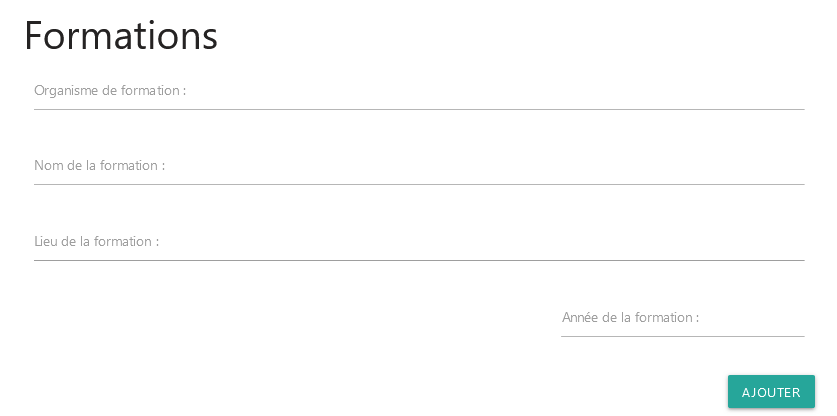

# Générateur de CV

Une application React qui génère un CV à partir des données renseignés par l'utilisateur.


## Outils

- JSX
- CSS
- Materialize - Framework CSS
- React - Librairie Javascript
- ❤️

## Apprentissage

C'est un projet React somme toute assez simple. Il a fallu tout d'abord établir la structure et le rendu entre le mode "édition" et le mode "impression".

Comme le projet est rattaché à la section "States and Effects" du cursus React de [theodinproject](https://www.theodinproject.com/paths/full-stack-ruby-on-rails/courses/react#states-and-effects), j'ai pris le partie de n'utiliser que ce qui a été vu dans le cours jusqu'à maintenant.

J'ai particulièrement axé mes efforts sur la structure de l'application, la gestion des états et des accessoires, et négligé l'aspect visuel en utilisant Materialize et un poil de CSS. Je reviendrais surement sur le projet plus tard, ça me laisse des axes d'amélioration.

## Caractéristiques

Tous les composants gèrent eux même leur affichage en mode Edition ou Print selon un état qui sauvegarde le mode en cours.
```js
const [editionMode, setEditionMode] = useState(false)
```

 - ### Le profil
 permet de renseigner toutes les informations basiques (nom, prénom, adresse, ...), mais également le titre du CV qui sera affiché à la place du nom de l'application en mode Print. Une photo est également chargeable.

 

 Les états sont gérés dans le composant **<App/>** et transmis par accessoires jusqu'au composant **<Profil/>**. Ce dernier possède deux méthodes pour gérer les évènements **Change** sur les inputs.
 ```js
 const handleChange = (event) => {
        const newDatas = { ...datas, [event.target.id]: event.target.value }
        setDataProfil(newDatas)
    }

    const handleChangeFile = (event) => {
        event.preventDefault()
        console.log(event.target.files[0])
        const newDatas = { ...datas, photo: URL.createObjectURL(event.target.files[0]) }
        setDataProfil(newDatas)
    }
 ```
 - ### Les formations et les expériences professionnelles
 sont deux composants très similaires, mais je devais les séparer car l'affichage conditionnel devenait trop pénible. Tous deux ont un état dans le composant **<App/>**, des tableaux afin de pouvoir créer l'affichage des expériences dynamiquement avec **map()**.
 
 
 
 
 Mais ces deux composants ont également leur propre état, un objet qui récupère tous les champs avant de les ajouter, avec une méthode que l'on passe à l'évènement **click** d'un bouton, au tableau des expériences correpondant.
 ```js
 const [formationValues, setFormationValue] = useState({})

    const handleChange = (event) => {
        const newValues = { ...formationValues, [event.target.name]: event.target.value }
        setFormationValue(newValues)
    }

    const addExp = (event) => {
        const inputs = event.target.parentElement.querySelectorAll('input')
        const newExp = { ...formationValues, id: uuidv4() }
        const copyDatasArray = datas

        copyDatasArray.push(newExp)
        setDataFormation(copyDatasArray)
        Array.from(inputs).map(input => input.value = '')
        setFormationValue({})
    }
 ```
 On notera l'utilisation du package **uuid** pour gérer dynamiquement les identifiants nécessaires à la création d'une liste à partir d'un tableau en React. Puisque l'on peut ajouter une expérience, il faut pouvoir la retirer, donc des boutons de suppression ont été prévu, et une méthode pour les retirer du tableau correspondant.
 ```js
 const removeExp = (event) => {
        const oldExpId = event.target.previousSibling.id
        const copyDatasArray = datas.filter(data => data.id !== oldExpId)

        setDataFormation(copyDatasArray)
    }
 ```
 Les listes créés à partir des tableaux de données d'états sont créer dans un composant prévu à cet effet, **<ExpContainer/>**.
 - ### Les builders
 Deux composants s'occupent uniquement de l'affichage des expériences. Tout d'abord **<ExpContainer/>** qui s'occupe de **map()** les tableaux d'expériences pour créer une liste de composants **<ExpResume/>** auxquels il passe les données de chaque expériences.
 ```js
 {datas.length > 0 && datas.map((data) => {
                const date = id === 'formations-exp' ? data.year : [data.startDate, data.endDate]
                const margin = datas.indexOf(data) === datas.length - 1 ? 'mb-0' : ''

                return (
                    <>
                        <ExpResume
                            container={id}
                            key={data.id}
                            id={data.id}
                            name={data.name}
                            title={data.title}
                            location={data.location}
                            responsabilities={data.responsabilities}
                            date={date}
                            margin={margin}
                        />
                        {editionMode && (
                            <Button key={`${data.id}-btn`} type="button" text="Supprimer" onClick={removeExp} />
                        )}
                    </>
                )
            })}
 ```
 Ensuite **<ExpResume/>** affiche conditionnellement les données selon si elles proviennent des formations ou des expériences professionnelles.
 ```js
 {container === 'formations-exp' ? (
                <div id={id} className={`row ${margin}`}>
                    <div className="col s4 side-container pb-20">
                        <h6>Année {date}</h6>
                        <h6>{location}</h6>
                    </div>
                    <div className="col s8">
                        <h6><b>{title}</b> chez <i>{name}</i></h6>
                        <div className="d-flex">
                        </div>
                    </div>
                </div>
            ) : (
                <div id={id} className={`row ${margin}`}>
                    <div className="col s4 side-container pb-20">
                        <h6>{title}</h6>
                        <h6>{name} - {location}</h6>
                        <h6>{date}</h6>
                    </div>
                    <div className="col s8">
                        <h6>{responsabilities}</h6>
                    </div>
                </div>
            )}
 ```
 - ### Les utilitaires
 Deux composants utilitaires et réutilisés partout dans l'application ont été créé. Le composant **<Button/>** qui selon les accessoires qu'on lui passe s'affichera différement.
 ```js
 export const Button = ({ type, text, classBtn = '', onClick }) => {
    return (
        <button className={`waves-effect waves-light btn ${classBtn}`} type={type} onClick={onClick}>{text}</button>
    )}
 ```
 Et le composant **<Input/>**, un peu plus complexe car il gère l'affichage de tous les inputs de l'application, selon les accessoires qu'on lui passe, il peut afficher tout type d'input.
 ```js
 const Input = ({ htmlFor, type, name, id, text, required = false, classDiv, onChange, value, src }) => {}
 ```

## Rendu impression et téléchargement

En mode impression, nous avons 3 options :
- Editer, qui permet de revenir sur le mode édition de son CV;
- Imprimer, qui lance l'impression.
- Télécharger, qui cache les boutons et lance une alerte, pour télécharger la page au format PDF il faudra pour le moment utiliser un plugin de navigateur.


## Possibles améliorations futures

- Conserver les données dans une API, ce qui évitera de passer tous les états en accessoires depuis le composant principal.
- Améliorer le CSS existant, pour faire un design plus proche d'un CV professionnel. Pourquoi pas ajouter un jeu de feuilles CSS pour des design différents.
- Rajouter des champs au formulaire, particulièrement ceux des **Skills** qui réunira les compétences, les langues et les hobbies. Un composant pour gérer les templates de CV sera également nécessaire si l'on implémente un jeu de feuilles de styles CSS.