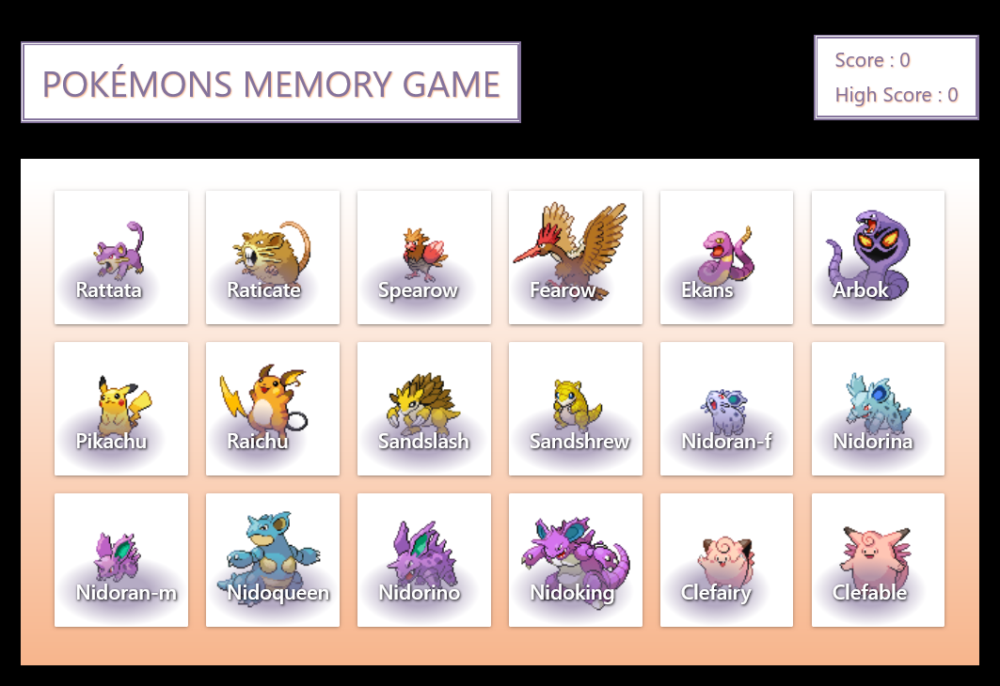
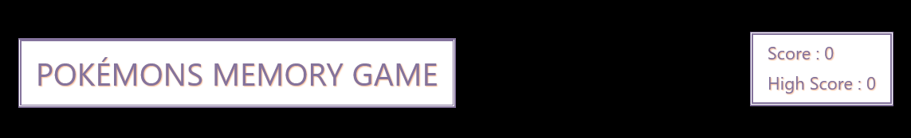
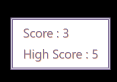
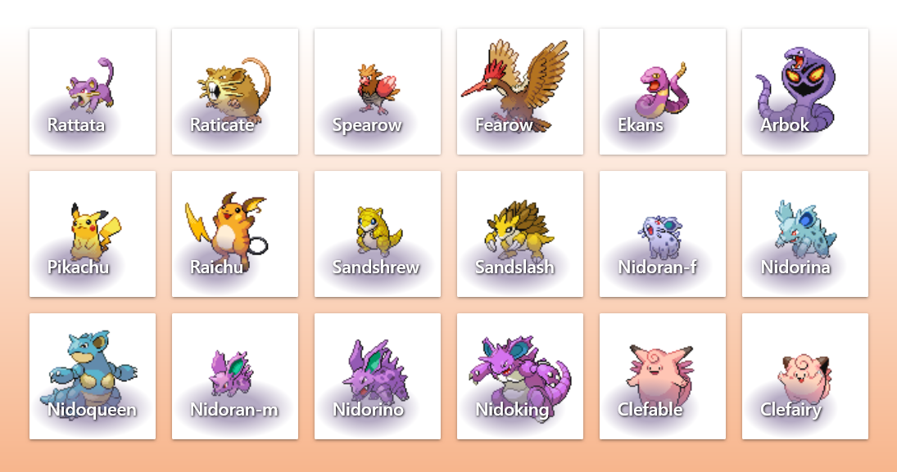
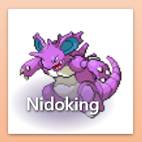
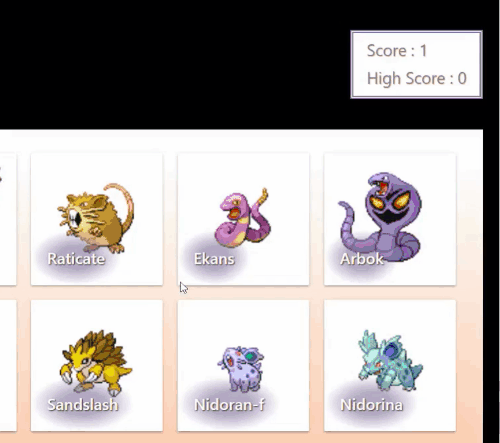
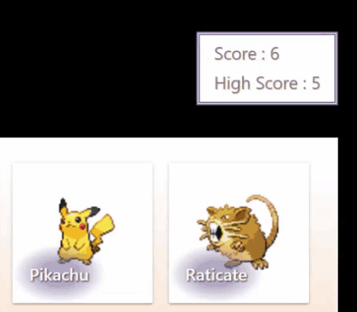
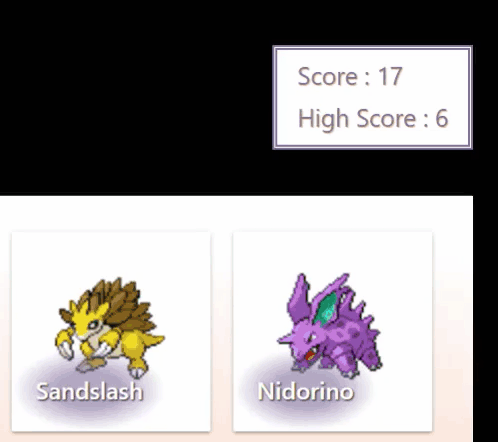
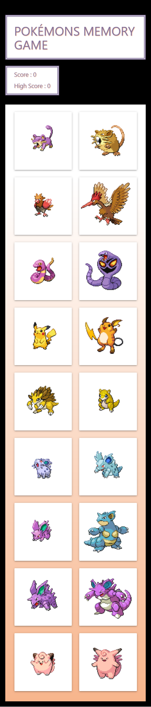

# Jeu de mémoire

Une application React qui simule un jeu de mémoire. Le but du jeu est de ne cliquer qu'une seule fois sur chaque carte durant un même tour de jeu. Un nouveau tour de jeu reprend lorsque vous faites une erreur ou que vous avez cliquer une fois sur toutes les cartes durant ce tour de jeu.



## Outils

- JSX
- CSS
- Materialize - Framework CSS
- React - Librairie Javascript
- [React Hot Toast](https://react-hot-toast.com/) - Package
- [PokeAPI](https://pokeapi.co/) - API
- ❤️

## Apprentissage

Encore un projet React plutôt simpliste. Il a fallu en premier lieu, établir la structure, afin de gérer le passage des états jusqu'aux composants concernés.

Comme le projet est rattaché à la section "States and Effects" du cursus React de [theodinproject](https://www.theodinproject.com/paths/full-stack-ruby-on-rails/courses/react#states-and-effects), j'ai pris le partie de n'utiliser que ce qui a été vu dans le cours jusqu'à maintenant.

Beaucoup de recherche sur le **fetch()** d'une **API**, de lecture de sa documentation pour récupérer les bonnes informations. Utilisation du hook **useEffect** afin de charger les données en provenance de l'API. Et beaucoup de temps perdu sur les notifications, il suffit de recharger le logiciel lorsqu'on utilise un builder comme ViteJS après avoir installer un package React.

## Caractéristiques

Trois états permettent de gérer le rendu des différents composants de l'application.

Le jeu d'images récupérées depuis l'API :
```js
const [images, setImages] = useState([])
```
Les images sur lesquelles on a déjà cliqué :
```js
const [viewedImages, setViewedImages] = useState([])
```
Et le compteur pour les scores :
```js
const [count, setCount] = useState({
        score: 0,
        highScore: 0
    })
```

Nous disposons également d'une méthode **getImages()** qui se charge de récupérer les données en provenance de l'API. Et nous passons cette méthode dans le useEffect afin de ne rendre qu'une fois lors du chargement des images depuis l'API.

```js
const getImages = () => {
        fetch('https://pokeapi.co/api/v2/pokemon/?limit=18&offset=18', {
            type: 'Get'
        }).then(response => response.json())
            .then(json => {
                const results = json.results

                for (let i = 0; i < results.length; i++) {
                    fetch(`https://pokeapi.co/api/v2/pokemon/${results[i].name}/`, {
                        type: 'Get'
                    }).then(result => result.json())
                        .then(pokemon => {
                            const id = pokemon.id
                            const alt = pokemon.name
                            const src = pokemon.sprites.front_default
                            setImages(prevPokemons => [...prevPokemons, { id, alt, src }])
                        })
                }
            })
    }

    useEffect(() => {
        getImages()
    }, [])
```

A noter que j'ai du retirer le mode **Strict** (propre au développement sur React) qui force notamment les useEffects à se relancer deux fois pour voir si il y a des effets de bord. Le souci c'est qu'en relançant une deuxième fois le hook, je me retrouvais avec le double des éléments souhaités.

 - ### L'en-tête
 affiche tout simplement le titre de l'application, mais également la panneau des scores.

 

Ses accessoires sont hérités de son composant parent **<MemoryGame/>**. Et il est transmet à son seul enfant, le composant **<Score/>. C'est ce dernier qui doit afficher le score du tour en cours et le score le plus élevé qu'à connu l'application.



C'est la méthode **handleScore()** qui s'occupe, entre autre, de mettre à jour l'état des scores. Mais comme cela se passe au moment du clic sur une carte, elle gère également l'ajout au tableau des images vues, l'image sur laquelle on vient de cliquer si elle n'en fait pas déjà partie. Pour finir cette fonction mélange le tableau des images si l'utilisateur ne s'est pas trompé et qu'il reste des images à découvrir. On la retrouve dans le coeur de l'application, le composant **<MemoryGame/>**.

 ```js
 const handleScore = (event) => {
        const lastImage = event.currentTarget.firstChild

        if (viewedImages.indexOf(lastImage.src) === -1) {
            let newCount = count.score + 1
            setViewedImages([...viewedImages, lastImage.src])
            setCount({ ...count, score: newCount })
        } else {
            if (count.score > count.highScore) {
                const newHighScore = count.score
                setCount({ score: 0, highScore: newHighScore })
            } else {
                setCount({ ...count, score: 0 })
            }

            setViewedImages([])
            return toast.error('Dommage...')
        }

        if (viewedImages.length === images.length - 1) {
            setViewedImages([])
            return toast.success('Bien joué !')
        } else if (count.score > 0) {
            images.sort(() => Math.random() - 0.5);
        }
    }
 ```
 - ### Le plateau
 contient les cartes du jeu. Ses seules fonctions sont de mapper la liste des images et de passer les accessoires au composant enfant **<Card/>**.
 
 
 
 - ### Les cartes
 renvoie les images avec leur texte associé, jusqu'à une certaine taille d'écran.

 
 
 Elles accueillent la fonction **handleScore**, ce qui permet de récupérer l'attribut source et de le stocker dans le tableau des images déjà vues si il n'y est pas déjà présent. Après chaque clic, les cartes se mélangent.

  
 
 - ### Les notifications "Toast"
 sont de petites fenêtres qui s'affichent sur l'écran pour signaler quelques choses en rapport aux actions de l'utilisateur. On utilise pour se faire le package react-hot-toast, qui possède une documentation très fournie et qui est très personnalisable. Nous avons donc défini deux types de notifications :

 une pour signifier que l'on a perdu.

 

 l'autre pour annoncer la victoire.

 

## Responsive
Vu que l'application était plutôt simple à concevoir, j'ai un peu plus travailler l'aspect visuel. Notamment le responsive qui permet de la consulter convenablement sur tous les supports.



## Derniers ajouts

- Effets qui rendent plus visible la possibilité de clic sur les cartes (pointeur, animation de survol).
- Ecrans de transition en cas de victoire ou de défaite.
- Minuteur pour annoncer l'arrivée de la prochaine ronde.

## Possibles améliorations futures

- Utiliser un **localStorage()** pour ne pas avoir à multiplier excessivement les appels API.
- Proposer dans l'en-tête la possibilité de modifier les couleurs.